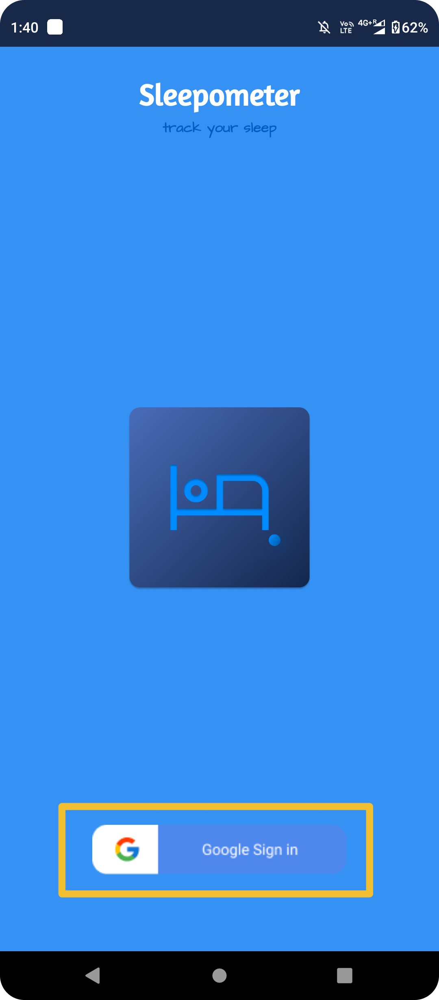
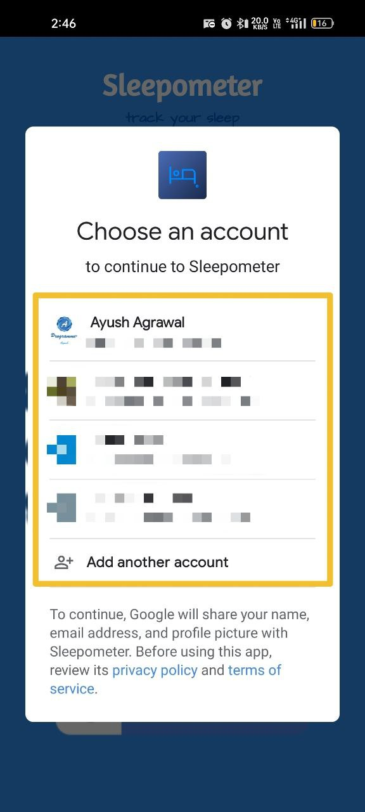
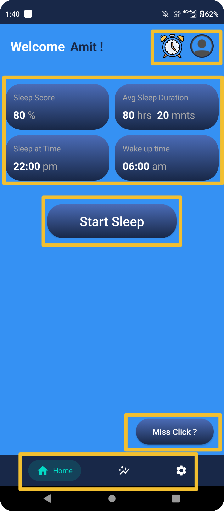

# Flow Of Control
## Guidelines for new Users
 

### Opening Screen
 
 

 

### Login with Google on this screen
 
 

 

### Select account to login
 
 

 

### Home Page
 
 

 

#### At the center of screen you will find your Sleep Score, Average Sleep Duration.
#### You can also _Start Sleep_ at the buttom right below it.
#### At top-right you can visit you profile and also go to _Clock_ app to set alarm.
#### You will find a floating dialog _Miss Click ?_ at bottom right
#### At the very end you can Navigate between **Home**, **Stats**, **Settings**. 

 

### Stats Page
 
 

 

#### You can find your stats here datewise.
 

### Settings Page
 
 

 

### Profile Page
 
 

####  You can logout here.
 