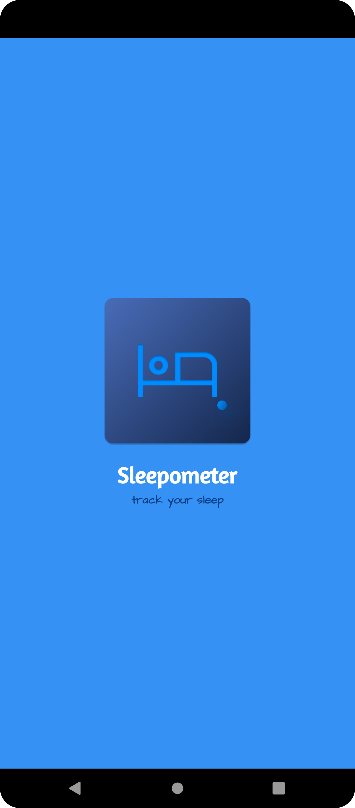
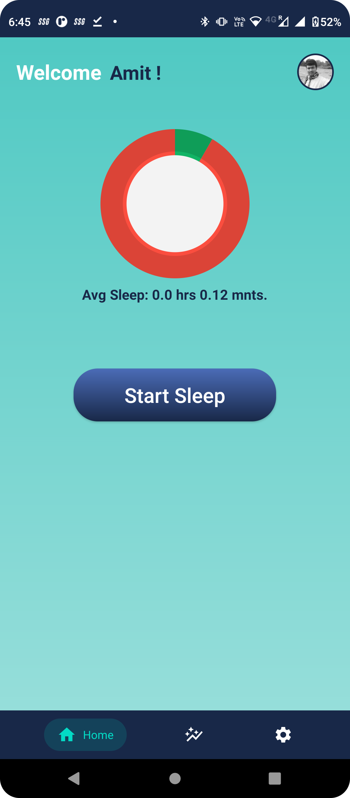
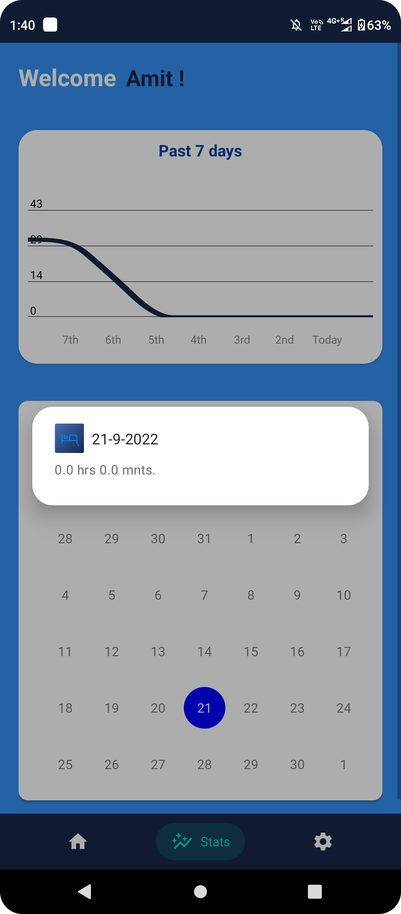
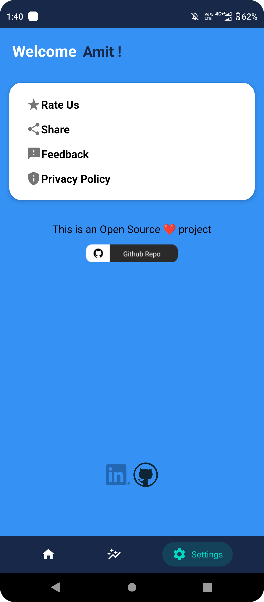
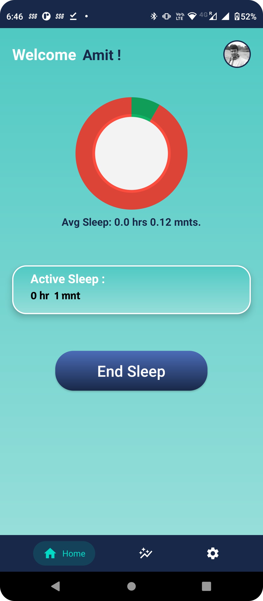

# Sleepometer 😴 Android App 

 </a> <a href="https://www.java.com" target="_blank">  </a> <a href="https://www.java.com" target="_blank">  
  
  
## 🔗 Download the App 

<a href="https://play.google.com/store/apps/details?id=sleepometerbyamitmaity.example.sleepometer"></a>
 
 ## 🤔 What is this App
 
 ✍️ This will basically measure your sleep, and represent the overall day-wise sleep hours and the last 7 days' average sleep also can measure.
 
 ## 💡 Features Used

1. Used Firebase Realtime Database to store data. 
2. Used Google SignIn Auth
3. Shared Preference for store temp data
3. Pie Chart, Line Chart 
4. CalendarView


<h1 align=center> Project Participated </h1>
 <p align="center">
  <a href="https://github.com/maityamit"></a>
  

<h1 align=center> Project Admin  🤵 </h1>

  <p align="center">
  <a href="https://github.com/maityamit"></a>

  <p align="center">
  <a target="_blank"href="https://www.linkedin.com/in/maityamit/"></a>&nbsp;&nbsp;&nbsp;&nbsp;
  <a href="maityamit308@gmail.com"></a>&nbsp;&nbsp;&nbsp;&nbsp;
  <a href="https://www.instagram.com/amit_maity_2003/"></a>&nbsp;&nbsp;&nbsp;&nbsp;
</p>
<br>

<h1 align=center> Projects Contributors ✨ </h1>

  

<table>
  <p align="center">
  <tr>
    <td align="center"><a href="https://github.com/afreenabegum"><br><h2>Vikas Kumar</h2>#9 - HSOC22-Level-1<br>#11 - HSOC22-Level-2</td>

 </tr>
    
  </p>
  </table>


<br>
  
  
<a href="https://github.com/maityamit/Tracky-Track-your-goals-or-targets/graphs/contributors">

</a>
  
  <br>
  
  ## 📸 Screenshots
 

 

||||
|:----------------------------------------:|:-----------------------------------------:|:-----------------------------------------:|
|  |  |  |
|  |  |  |
|  |  | |
  
  
  
# How to Contribute

If you think that you can add a new feature or want to fix a bug, we invite you to contribute to FunwithPhysics and make this project better. To start contributing, follow the below instructions:

1. Create a folder at your desire location (usually at your desktop).

2. Open Git Bash Here

3. Create a Git repository.

   Run command `git init`

4. Fork this Repo

5. Clone your forked repository of project.

```git clone
git clone https://github.com/<your_username>/Sleepometer-Android-App.git
```

6. Navigate to the project directory.

```
cd Sleepometer-Android-App
```

7. Add a reference(remote) to the original repository.

```
git remote add upstream https://github.com/maityamit/Sleepometer-Android-App.git
```

8. Check the remotes for this repository.

```
git remote -v
```

9. Always take a pull from the upstream repository to your main branch to keep it updated as per the main project repository.

```
git pull upstream main
```

10. Create a new branch(prefer a branch name that relates to your assigned issue).

```
git checkout -b <YOUR_BRANCH_NAME>
```

11. Perform your desired changes to the code base.

12. Check your changes.

```
git status
```

```
git  diff
```

13. Stage your changes.

```
git add . <\files_that_you_made_changes>
```

14. Commit your changes.

```
git commit -m "relavant message"
```

15. Push the committed changes in your feature branch to your remote repository.

```
git push -u origin <your_branch_name>
```

16. To create a pull request, click on `compare and pull requests`.

17. Add an appropriate title and description to your PR explaining your changes.

18. Click on `Create pull request`.

Congratulations🎉, you have made a PR to the FunwithPhysics.
Wait for your submission to be accepted and your PR to be merged by a maintainer.
