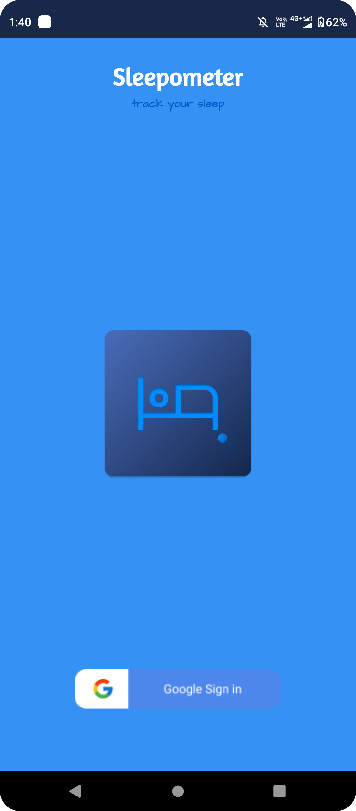
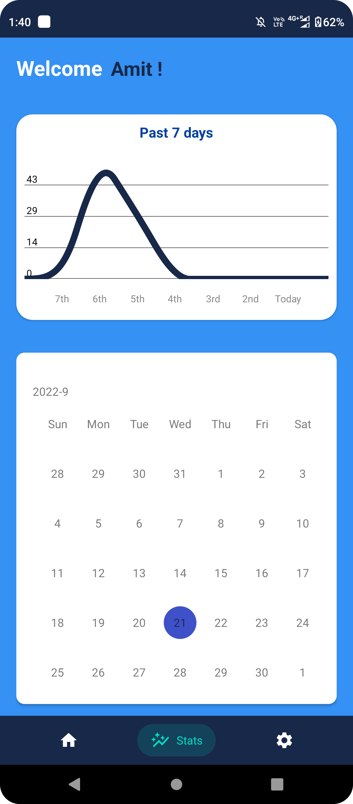

# Sleepometer 😴 Android App 

 
  
  
## 🔗 Download the App 

 
 ## 🤔 What is this App
 
 ✍️ This will basically measure your sleep, and represent the overall day-wise sleep hours and the last 7 days' average sleep also can measure.
 
 ## 💡 Features Used

1. Used Firebase Realtime Database to store data. 
2. Used Google SignIn Auth.
3. Shared Preference for store temp data.
4. Pie Chart, Line Chart.
5. CalendarView.

  ## 🛣️ How to use this app ?
  ### &nbsp; &nbsp; &nbsp; [Flow of Control](FlowofControl.md)

<h1 align=center> Project Admin  🤵 </h1>

  

  

  

  &nbsp;&nbsp;&nbsp;&nbsp;
  &nbsp;&nbsp;&nbsp;&nbsp;
  &nbsp;&nbsp;&nbsp;&nbsp;

  
 
   
   
 
  
<h1 align=center> Project Participated ✨ </h1>
 

  
  1. Hacktoberfest  
  2. HackClub RAIT  
  3. Kharagpur Winter of Code  
  4. Iwoc  
  5. JGEC Winter of Code  
  

 

<h1 align=center> Projects Contributors ✨ </h1>

  

<table>
<tr>
<td align="center"> <h2>Vikas Kumar</h2></td>
<td align="center">   <h2>Anurag shukla</h2></td>
<td align="center">   <h2>Joydeep Paul</h2></td>
<td align="center">  <h2>Anjali</h2></td>
<td align="center">  <h2>MOHAMMAD KAIF</h2></td>

</tr>

<tr>
<td align="center"> <h2>Syed Quasim</h2></td>
<td align="center">   <h2>Venkatesh Lingampally</h2></td>
<td align="center"> <h2>RShokeen</h2></td>
<td align="center">   <h2>Vishal Anand</h2></td>
<td align="center"> <h2>KULDEEP SINGH</h2></td>

</tr>

<tr>
<td align="center"> <h2>AstroITNinja</h2></td>
<td align="center">   <h2>Kshitij Patil</h2></td>

</tr>
    
</table>

 
  
  

  
   
</a>
  

## <h1 align=center>Screenshots 📸</h1>

 

||||
|:----------------------------------------:|:-----------------------------------------:|:-----------------------------------------:|
|  |  |  |
|  |  |  |
|  |  | |
  
  

 
 
  
  
[Amit Maity](https://www.linkedin.com/in/maityamit)

---

    <h3><b>Take a moment to star ⭐ the project if you like it</b></h3>
    <h3>Do checkout the other repos 💫</h3> 

